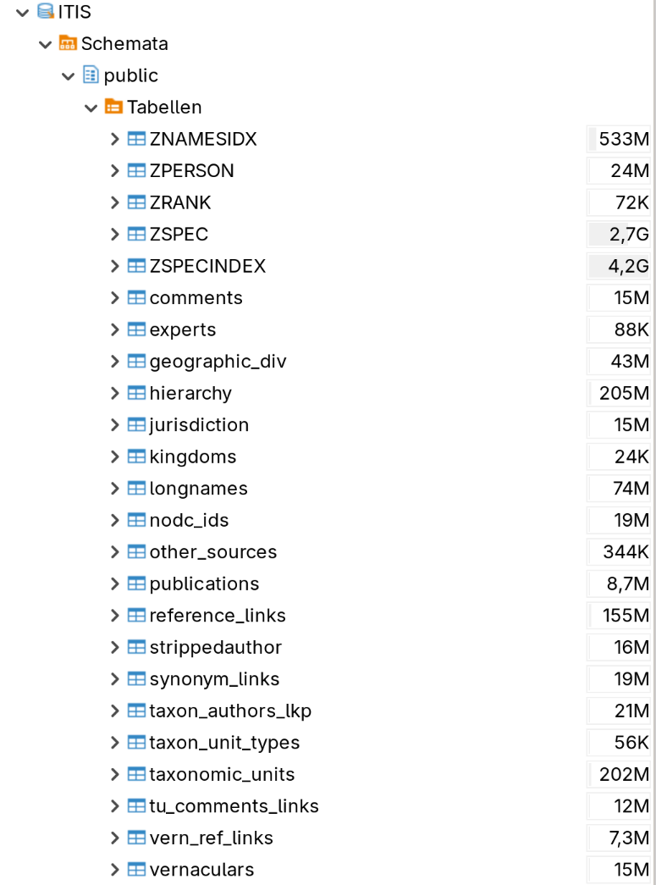
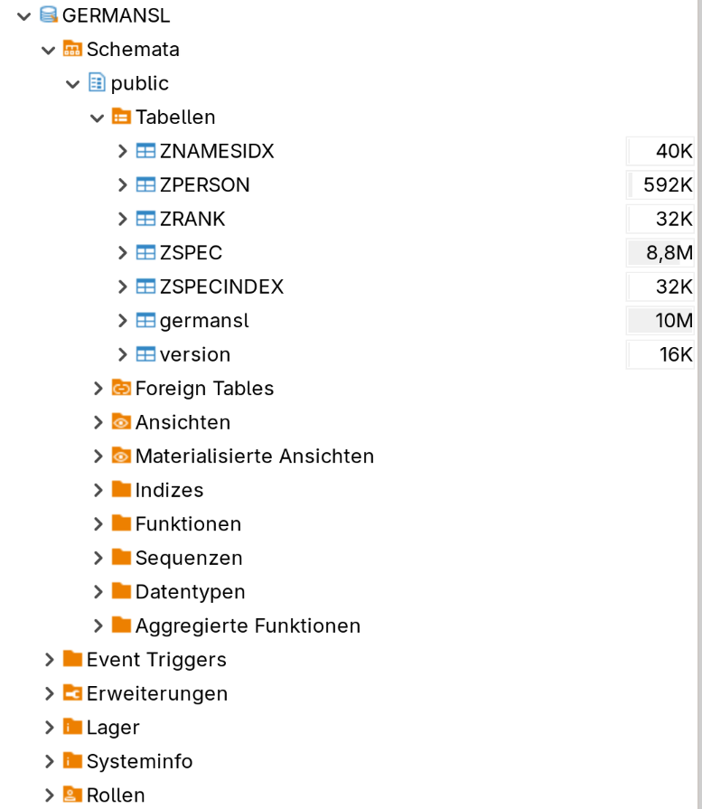

# Eine SQLite Core Data Datenbankdatei für iOS Apps erstellen

Dieses Projekt zeigt eine Daten-Pipeline. Sie verschiebt Datensätze in eine SQLite-Datenbank, die kompatibel mit Apple Core Data ist. Als Beispiel dienen taxonomische Daten von `ITIS` oder `GermanSL`.

Der Ablauf besteht aus zwei Teilen:

1.  **Zieldatenbank auf macOS vorbereiten:**

    * Ein Xcode-Modell (`Taxa.xcdatamodeld`) definiert das Schema.
    * Ein Werkzeug für die Kommandozeile in Swift (`sqlite-tool-suite`) kommt zum Einsatz. Es erstellt eine *leere* `SYSTEM.sqlite`-Datei. Diese Datei enthält das richtige Schema für Core Data und alle nötigen Tabellen für Metadaten (wie `Z_METADATA`, `Z_PRIMARYKEY`).

2.  **Daten auf Linux verarbeiten (ETL):**

    * Ein Skript in `zsh` (`convert.zsh`) steuert den ganzen Prozess.
    * Es lädt die Rohdaten (zum Beispiel `ITIS.sql`) in eine Zwischen-Datenbank in `PostgreSQL`.
    * Es ruft ein Skript in `Python` auf (`migrate.py` mit `psycopg2`). Dieses Skript wandelt die Daten um. Es baut Hierarchien auf (`ZAGGS`), verarbeitet Synonyme und erstellt einen Suchindex (`ZSPECINDEX`).
    * Am Ende exportiert das Skript die bereinigten Daten mit `pg_dump`. Es lädt sie dann mit `sqlite3` in die Zieldatenbank, die vorher in Swift erstellt wurde.

---

Das Projekt ist keine fertige Lösung, die man sofort für andere Projekte nutzen kann. Es zeigt aber Verfahren, die man übernehmen kann. Auch wie die Skripte aufgebaut sind, kann nützlich sein.

`Core Data` ist ein Framework von Apple. Es speichert Daten auf iPadOS, iOS und macOS.
Eine Technik, die `Core Data` zum Speichern auf dem Dateisystem nutzen kann, ist `SQLite`. Das kommt hier zum Einsatz.

Apple bietet keine offizielle Hilfe an, wie man kompatible `SQLite`-Datenbanken erstellt. Es steht auch nirgends, wie man sie mit Standard-SQL füllt. `Core Data` hat auch keine Schnittstelle, um SQL-Befehle direkt auszuführen.

Normalerweise sieht man als Entwickler die `SQLite`-Dateien nicht. Man sollte sie auch nicht direkt ändern oder erstellen. Der normale Weg geht nur über das Framework von `Core Data` und das Modellierungs-Werkzeug in `Xcode`.

Weil Dokumentation fehlt, war am Anfang etwas Forschung und Experimentieren nötig.
Das Projekt zeigt nun einen getesteten Ablauf und Skripte, die gut funktionieren.

Dieser Weg hat schon oft kompatible Datenbanken erzeugt. Diese kamen direkt in älteren iOS-Apps zum Einsatz ([App Handbuch](https://drive.google.com/file/d/1Vi8G3tcm_xNRM7rVRlazCnU-4urAx9Nd/view?usp=drive_link)).

## Erste Schritte

Alle Quellcodes liegen hier: [src](/src/). Das Beispiel-Datenmodell liegt hier: [datamodel](/datamodel/).

Die Skripte sind recht komplex. Das liegt an den komplexen Datenmodellen von Quelle und Ziel.
Wer diese Skripte als Idee für eigene, einfachere Projekte nutzt, wird mit kürzeren und einfacheren Skripten zurecht kommen.

Die hier genutzten Techniken sollten aber ausreichen, um viele übliche Probleme zu lösen. Das gilt besonders, wenn man Daten von `PostgreSQL` zu `Core Data` `SQLite` migriert.

Die Skripte in `zsh` und `Python` liefen zuletzt erfolgreich auf `Arch Linux 6.18.6-arch1-1`.

Es gibt ein kleines Werkzeug für die Kommandozeile in Swift: `sqlite-tool`. Man kann es auf `macOS` bauen und ausführen. Es lief zuletzt auf einem Silicon Mac und einem Intel Mac mit `Xcode 26.2`. Siehe '`sqlite-tool` bauen' weiter unten.

## Einrichten

### Versionen

Getestete Versionen:

#### Linux (hier Arch Linux)

```bash
(.venv) user@archlinux ~/Projekte/github/sqlite-core-data-creation/src % uname -r
6.18.6-arch1-1

(.venv) user@archlinux ~/Projekte/github/sqlite-core-data-creation/src % zsh --version
zsh 5.9 (x86_64-pc-linux-gnu)

(.venv) user@archlinux ~/Projekte/github/sqlite-core-data-creation/src % python --version
Python 3.14.2

(.venv) user@archlinux ~/Projekte/github/sqlite-core-data-creation/src % sqlite3 --version
3.51.2 2026-01-09 17:27:48 b270f8339eb13b504d0b2ba154ebca966b7dde08e40c3ed7d559749818cbalt1 (64-bit)

(.venv) user@archlinux ~/Projekte/github/sqlite-core-data-creation/src % psql --version
psql (PostgreSQL) 18.1
```

#### macOS (Intel)

```bash
user@mac sqlite-core-data-creation % uname -r

24.6.0

user@mac sqlite-core-data-creation % xcodebuild -version

Xcode 26.2

Build version 17C52

user@mac sqlite-core-data-creation % swift --version                                                

swift-driver version: 1.127.14.1 Apple Swift version 6.2.3 (swiftlang-6.2.3.3.21 clang-1700.6.3.2)

Target: x86_64-apple-macosx15.0
```

### Einrichten auf Linux (hier Arch Linux)

1.) Basis-Werkzeuge installieren.
Dieser Befehl installiert Zsh, PostgreSQL, Python, das Werkzeug für virtuelle Umgebungen (venv) und die SQLite Kommandozeile.

```bash
sudo pacman -S zsh postgresql python python-venv sqlite
```

```bash
yay -S pyenv pyenv-virtualenv
```

2.) (Optional) Einen grafischen DB-Client installieren (zum Beispiel DBeaver).

```bash
sudo pacman -S dbeaver
```

*Hinweis zu Java:* Wenn man `dbeaver` installiert, fragt `pacman` nach einer Java Laufzeitumgebung. Eine gute und einfache Wahl ist `jre21-openjdk`.

3.) PostgreSQL konfigurieren, um ein eigenes Datenverzeichnis zu nutzen.
Das ist nützlich, wenn die Daten auf einer separaten Festplatte liegen sollen (zum Beispiel eine SSD unter /mnt/datassd).

a. Die neuen Verzeichnisse erstellen und Rechte vergeben (den Pfad `/mnt/datassd` anpassen):
```bash
sudo mkdir -p /mnt/datassd/postgresql/data
sudo chown -R postgres:postgres /mnt/datassd/postgresql/
sudo chmod 700 /mnt/datassd/postgresql/data
```

b. Den Datenbank-Cluster initialisieren. Das muss man *als* Benutzer `postgres` tun (Locale anpassen falls nötig):

```bash
sudo -iu postgres initdb --locale=de_DE.UTF-8 -E UTF8 -D '/mnt/datassd/postgresql/data'
```

c. Dem Dienst `systemd` den neuen Pfad mitteilen.
   Dazu `sudo systemctl edit postgresql.service` ausführen. Das öffnet eine Datei zum Überschreiben. Dort folgenden Inhalt einfügen (Pfade anpassen):

```ini
[Service]
Environment=PGROOT=/mnt/datassd/postgresql
Environment=PGDATA=/mnt/datassd/postgresql/data
PIDFile=/mnt/datassd/postgresql/data/postmaster.pid
```

d. `systemd` neu laden und den Dienst starten:
```bash
sudo systemctl daemon-reload
sudo systemctl start postgresql.service
sudo systemctl enable postgresql.service
```

4.) Ein Passwort für den PostgreSQL Admin-Nutzer setzen.

a. Zum System-Benutzer `postgres` wechseln:
```bash
sudo -iu postgres
```
b. Die Konsole `psql` öffnen (das passiert innerhalb der Shell von Benutzer `postgres`):
```bash
psql
```
c. Das Passwort in der `psql` Konsole setzen:
```sql
ALTER USER postgres WITH PASSWORD 'DeinStarkesPasswort';
```

d. Die `psql` Konsole und die Shell verlassen:

```bash
\q
exit
```

5.) Die Python-Umgebung einrichten.
Die Skripte brauchen eine Python-Umgebung mit der Bibliothek `psycopg2`.

a. Eine virtuelle Umgebung im Projektordner erstellen:
   ```bash
   python -m venv .venv
   ```
b. Die Umgebung aktivieren (das muss man jedes Mal tun, wenn man am Projekt arbeitet):
   ```bash
   source .venv/bin/activate
   ```
c. Das benötigte Python-Paket installieren:
   ```bash
   pip install psycopg2
   ```

### Einrichten auf macOS (hier mit Intel Plattform)

1.) `Xcode` installieren (Die letzte erfolgreich getestete Version war 26.2).

2.) `sqlite-tool` bauen:

    cd src/swift/sqlite-tool-suite
    sqlite-tool-suite % swift build -c release

```bash
user@mac sqlite-tool-suite % swift build -c release

Fetching [https://github.com/apple/swift-argument-parser](https://github.com/apple/swift-argument-parser)
Fetched [https://github.com/apple/swift-argument-parser](https://github.com/apple/swift-argument-parser) from cache (2.53s)
Computing version for [https://github.com/apple/swift-argument-parser](https://github.com/apple/swift-argument-parser)
Computed [https://github.com/apple/swift-argument-parser](https://github.com/apple/swift-argument-parser) at 1.6.2 (3.49s)
Creating working copy for [https://github.com/apple/swift-argument-parser](https://github.com/apple/swift-argument-parser)
Working copy of [https://github.com/apple/swift-argument-parser](https://github.com/apple/swift-argument-parser) resolved at 1.6.2
Building for production...
[15/15] Linking sqlite-tool
Build complete! (37.66s)
```

3.) Prüfen, ob das Bauen erfolgreich war:

```bash
user@mac sqlite-tool-suite % ./.build/release/sqlite-tool --help
OVERVIEW: A tool for Core Data sqlite creation and performing simple queries.

USAGE: sqlite-tool <subcommand>

OPTIONS:
  --version               Show the version.
  -h, --help              Show help information.

SUBCOMMANDS:
  new (default)           Create a new Core Data SQLite file.
  query                   Simple queries on the Taxa Core Data SQLite data base.

  See 'sqlite-tool help <subcommand>' for detailed help.
```

## Verwendung

Das Haupt-Skript ist `convert.zsh`.

### Syntax:

    convert.zsh -conf <conf> -username <username> -password <password>

Es gibt eine Konfigurationsdatei in `zsh`-Syntax namens `configuration.zsh`. Dort sind Array-Variablen mit Konfigurationsdaten definiert.

Die Namen dieser Variablen sind die gültigen Werte für den Parameter `<conf>` beim Aufruf von `convert.zsh`.

`<username>` und `<password>` müssen gültige Zugangsdaten für den PostgreSQL Datenbankserver sein.

Man sollte prüfen, ob Benutzername und Passwort in der Datei `~/.pgpass` stehen:

```bash
nano ~/.pgpass
localhost:5432:ITIS:<username>:<password>
```

### Ablauf:

Bevor das Skript starten kann, wird eine leere Core Data Zieldatenbank benötigt. Um so eine Datenbank zu erstellen, braucht man das `momd`-Format, welches das Datenmodell beschreibt.

Hier sind die Schritte [^note-1] :

**A.) `.momd` aus den Xcode Core Data Modelldateien `.xcdatamodeld` erzeugen**

Unter `user@mac sqlite-core-data-creation %`:

```bash
/Applications/Xcode.app/Contents/Developer/usr/bin/momc ./datamodel/Taxa.xcdatamodeld ./datamodel
```

Log (Beispiel):

```bash
Taxa56.xcdatamodel: note: Model Taxa56 version checksum: 7slBPn60d+0irFNGApudBcuf7UT65qkpYqiJI4ddXd4=
...
```

Warnungen können ignoriert werden.

**B.) Eine leere Core Data SQLite Datenbankdatei mit dem `sqlite-tool` erstellen**

Das erstellt die leere `SYSTEM.sqlite` mit den korrekten Core Data Tabellen:

Unter `user@mac sqlite-core-data-creation %`:

```bash
mkdir -p data
./src/swift/sqlite-tool-suite/.build/release/sqlite-tool new ./datamodel/Taxa.momd ./data/SYSTEM.sqlite System
```

```bash
Create Core Data SQLite database file:///Users/user/Projekte/github/sqlite-core-data-creation/data/SYSTEM.sqlite
Use Core Data SQLite database model file:///Users/user/Projekte/github/sqlite-core-data-creation/datamodel/Taxa.momd/
Model version: 61
Core Data SQLite database file is compatible
Core Data SQLite database file created file:///Users/user/Projekte/github/sqlite-core-data-creation/data/SYSTEM.sqlite
```

**C.) Die Datei `SYSTEM.sqlite` vom Mac auf den Linux Rechner kopieren**

Kopiere die Datei `data/SYSTEM.sqlite` in das Verzeichnis `data/` des Projekts auf dem Linux Rechner.

**D.) Die Konvertierung auf Linux starten. Das ist der Hauptschritt, der lange dauert.**

   `convert.zsh -conf ITIS_Complete -username <username> -password <password>`

[^note-1]: Die Schritte A.), B.) und C.) sind nur beim ersten Durchlauf nötig, um eine leere Core Data SQLite Datei zu erhalten.

`convert.zsh` automatisiert die gesamte Datenmigration von der Quell-Datenbank in die Ziel-Datei `.sqlite`:

Beispiel für den Aufruf mit der Konfiguration `ITIS_Complete_122325` unter `~/Projekte/github/sqlite-core-data-creation/src`

```bash
source ../.venv/bin/activate
time ./convert.zsh -conf ITIS_Complete_122325 -username postgres -password postgres
```

Log des Durchlaufs:

```bash
###################################
Import from proprietary data source
###################################
Importing /home/user/Projekte/gitrepos/sqlite-core-data-creation/origdata/itisPostgreSql122325/ITIS.sql data into Postgres ...
migrate PostgreSQL dump file to UTF8 
Create database and tables and import data
HINWEIS:  Datenbank »ITIS« existiert nicht, wird übersprungen
DROP DATABASE
CREATE DATABASE
Sie sind jetzt verbunden mit der Datenbank »ITIS« als Benutzer »postgres«.
... (SET-Befehle) ...
CREATE EXTENSION
...
CREATE TABLE
... (Viele CREATE TABLE, COPY und ALTER TABLE-Befehle) ...
COPY ...
...
COPY ...
ALTER TABLE
...
DROP EXTENSION
... (DROP/CREATE von Indizes, Tabellen, Sequenzen und Funktionen) ...
CREATE FUNCTION

###################################
Insert into Z Tables (postgres)
###################################
... (DROP/CREATE von Indizes, Tabellen, Sequenzen) ...
CREATE INDEX
INSERT 0 ...
INSERT 0 ...
UPDATE ...
... (Weitere UPDATEs) ...
Process select * from aggsupdateV02(50,10050) ...
... finished !
Process select * from aggsupdateV02(10051,20051) ...
... finished !
...
... (aggsupdateV02 wird in vielen Batches ausgeführt)
...
Process select * from aggsupdateV02(1190169,...) ...
... finished !
UPDATE 7
... (Weitere UPDATEs) ...

....

###################################
Insert into Z Tables (sqlite)
###################################
Exporting ZSPEC ...
memory
Exporting ZRANK ...
memory
Exporting ZNAMESIDX ...
memory
Exporting ZPERSON ...
memory
./convert.zsh -conf ITIS_Complete_122325 -username postgres -password postgres  71,53s user 24,78s system 4% cpu 32:06,85 total
```

Beispiel Ansicht der Datenbanken in `DBeaver` :

<div align="center">

ITIS DB  | GERMANSL DB |
:-------------------------:|:-------------------------:|
 |  | 
</div>

**E.) Weitere Konvertierungen starten (Schnell)**

Wenn man das Skript für andere Konfigurationen nutzt (wie `ITIS_Birds` aus `configuration.zsh`), erkennt es die `.copy`-Dateien. Dann überspringt es die langsamen Schritte für Import und Indexierung. Das geht dann schneller.

Beispiel für den Aufruf mit der Konfiguration `ITIS_Birds` unter `~/Projekte/github/sqlite-core-data-creation/src`

```bash
source ../.venv/bin/activate
time ./convert.zsh -conf ITIS_Complete_122325 -username postgres -password postgres
```

Log des Durchlaufs:

```bash
###################################
Import from ZSPEC and ZRANK and ZPERSON copy
###################################
SET
...
COPY ...
COPY ...
COPY ...
...
###################################
Insert into Z Tables (sqlite)
###################################
Exporting ZSPEC ...
memory
...
./convert.zsh -conf ITIS_Birds -username postgres -password postgres  20,32s user 7,71s system 12% cpu 3:39,45 total
```

**F.) Testen, ob die SQLite-Datenbank mit Core Data funktioniert**

Man kann das `sqlite-tool` auf dem Mac nutzen, um auf der Datenbank eine einfache Abfrage zu machen, damit testet man die `Core Data` Kompatibilität.

**Aus ITIS Build:**

Dazu eine erzeugte `SYSTEM.sqlite` als `ITIS.sqlite` auf den Mac in das Verzeichnis `sqlite-core-data-creation/data/` kopieren. Hier nutzen wir die `ITIS Complete` Datenbank aus dem Bau mit der Konfiguration `ITIS_Complete_122325`.

Auf dem Mac unter `sqlite-core-data-creation` Abfragen machen:

```bash
./src/swift/sqlite-tool-suite/.build/release/sqlite-tool query species-info ./data/ITIS.sqlite ./datamodel/Taxa.momd  "Bellis perennis"
```

```bash
Taxa <Bellis perennis> found with nr = 36826
```

```bash
./src/swift/sqlite-tool-suite/.build/release/sqlite-tool query species-info ./data/ITIS.sqlite ./datamodel/Taxa.momd  "Turdus grayi suarezi"
```

```bash
Taxa <Turdus grayi suarezi> found with nr = 1277085
```

```bash
./src/swift/sqlite-tool-suite/.build/release/sqlite-tool query species-info ./data/ITIS.sqlite ./datamodel/Taxa.momd  "Apis"
```

```bash
Taxa <Apis> found with nr = 154395
```

```bash
./src/swift/sqlite-tool-suite/.build/release/sqlite-tool query count-species ./data/GERNMANSL.sqlite ./datamodel/Taxa.momd
```

```bash
678128
```

**Aus GERMANSL Build:**

Die erzeugte `SYSTEM.sqlite` als `GERMANSL.sqlite` auf den Mac in das Verzeichnis `sqlite-core-data-creation/data/` kopieren. Hier nutzen wir die aus dem Bau mit der Konfiguration `GERMANSL_Complete`.

```bash
./src/swift/sqlite-tool-suite/.build/release/sqlite-tool query species-info ./data/GERMANSL.sqlite ./datamodel/Taxa.momd  "Bellis perennis"
```

```bash
Taxa <Bellis perennis> found with nr = 814
```

```bash
./src/swift/sqlite-tool-suite/.build/release/sqlite-tool query count-species ./data/GERMANSL.sqlite ./datamodel/Taxa.momd
```

```bash
15083
```

## Links

Hier sind die Quellen für die Daten.

### ITIS (Integrated Taxonomic Information System)

* **Startseite:** https://www.itis.gov/
* **Seite für Downloads:** https://www.itis.gov/downloads/index.html
* **PostgreSQL Datei (immer die neueste Version):** https://www.itis.gov/downloads/itisPostgreSql.zip

### GermanSL

* **Startseite:** https://germansl.infinitenature.org
* **Seite für Downloads:** https://germansl.infinitenature.org/downloads/
* **Datei Version 1.5.5 (vom 12.02.25):** https://germansl.infinitenature.org/GermanSL/1.5/GermanSL.zip